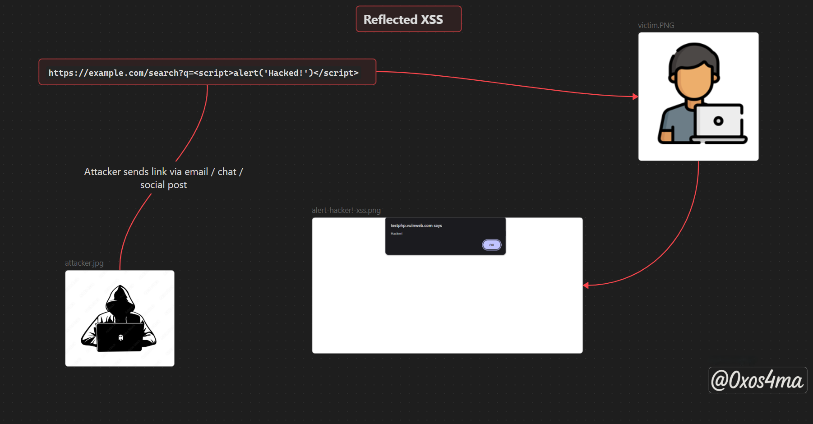

# Introduction

- Cross-Site Scripting (XSS) looks simple on the surface — an attacker injects a bit of script and the browser runs it — but that simplicity is what makes it so dangerous. A single unsanitized string rendered in the wrong context can let an attacker hijack sessions, perform actions as users, phish victims, or turn a trusted site into a malware delivery vector. For developers, XSS is a reminder that output encoding is business logic. For hunters and red-teamers, it’s one of the highest-leverage issues to find and chain with others.

- This blog is practical: a compact explanation of XSS, the common types (with diagrams and examples), the real risks, defenses developers should use, plus a short automation toolkit and a simple pipeline you can run to triage targets quickly.

---


## what is Cross Site Scripting (xss) : 

Cross-Site Scripting (XSS) is a web vulnerability that lets attackers inject malicious code into websites. This code runs in the victim’s browser, allowing attackers to bypass the same-origin policy, impersonate users, steal sensitive data, observe behavior, or even take full control of an application if the victim has high privileges. Though the name suggests “cross-site,” XSS now broadly covers any malicious content injection, making it one of the most dangerous threats in web security.

## types of Cross-Site-Scripting : 


---

## Risks of XSS :

When an attacker successfully exploits an XSS vulnerability, they can:

1. **Steal cookies and session tokens** → hijack user accounts.
2. **Perform actions as the victim** → e.g., change account settings, transfer money, send messages.
3. **Deface websites** → inject malicious content, fake forms, or pop-ups.
4. **Phish users** → trick them into entering sensitive information in a fake login form.
5. **Spread malware** → deliver malicious scripts to users via the vulnerable site.
6. **Escalate attacks** → combine with CSRF, clickjacking, or exploit chains for deeper access.
7. **Damage trust in the application** → even if the impact looks “small” (like an alert box), it proves an attacker can control what users see.

---

## Real-World Example (Simplified) :

Imagine a shopping website with a **search box** that doesn’t properly sanitize user input.

### Vulnerable URL:

```
https://example.com/search?q=shoes
```

If the website reflects the search term directly into the page without escaping, an attacker could send a link like:

```
https://example.com/search?q=<script>alert('Hacked!')</script>
```

### What happens?

- The victim clicks this link (perhaps sent via email or shared on social media).
- Instead of just showing “shoes” in the search results, the page runs the attacker’s script.
- In a real attack, instead of `alert('Hacked!')`, the script could:
    - steal cookies,
    - redirect the user to a phishing page,
    - or load a malicious file.


>The `alert('Hacked!')` example is a harmless test payload that security researchers use to prove the existence of XSS — it shows code execution without causing damage.


---

## Reflected XSS : 

- The payload is sent to the server and immediately reflected in the response. It’s commonly triggered by specially crafted links.

- **Typical places to find it :** search fields, error messages, query parameters, form results, and any input that is reflected back in the response.

#### how it's work :



- **In summary ,** Reflected XSS occurs when user-supplied input (often in a query parameter or form) is returned immediately in the server’s response without proper encoding. An attacker crafts a link containing a malicious script and convinces a victim to open it (email, social post, forum). When the victim loads the page, the injected script runs in their browser and can perform actions like showing popups, manipulating the page, or — in more serious cases — stealing non-HttpOnly cookies or performing actions on the victim’s behalf.


---


## Stored XSS :

- The malicious payload is stored on the server (database, message board, profile, comment, etc.) and served to other users later.

- **Typical places to find it :** comment sections, user profiles, message boards, product reviews, blog posts, and any content that will be re-rendered for other users.


#### how it's work :


- **In summary ,** Stored (persistent) XSS occurs when an attacker submits malicious script that the server saves (e.g., in a comment, profile, or review). Later, that stored payload is served to other users and runs in their browsers, allowing broad impact like session theft, phishing, or mass defacement.


---

## DOM-Based XSS :

- The vulnerability exists in client-side JavaScript. Data from a source (e.g., `location.hash`, `location.search`, `document.referrer`, or `postMessage`) is used to modify the DOM in an unsafe way (e.g., `innerHTML`, `document.write`, `eval`) without proper sanitization.
- **Typical places to find it :** `innerHTML`, `outerHTML`, `document.write`, `eval`, `setTimeout(string)`, `new Function(string)`, `element.src = ...` (if expecting JS), and `insertAdjacentHTML`.


#### how it's work :


- **In summary ,** DOM-Based XSS happens when client-side JavaScript takes untrusted data (like from the URL or hash) and inserts it into the page with unsafe methods (such as `innerHTML`). Unlike stored or reflected XSS, the attack is executed entirely in the user’s browser.


---


## XSS Mitigations & Best Practices

1. **Context-aware encoding** – Encode output depending on where it’s used (HTML, attributes, JS, URLs).
2. **Use framework templates** – Rely on auto-escaping, but avoid raw HTML (`dangerouslySetInnerHTML`, etc.).
3. **CSP (Content Security Policy)** – Block inline scripts and untrusted sources.
4. **Secure cookies** – Use `HttpOnly` + `Secure` flags to protect sessions.
5. **Sanitize input** – If HTML is allowed, use libraries like **DOMPurify**.
6. **Validate & normalize** – Enforce input types, length, and normalize before storing.

**Takeaway:** Layering these defenses greatly lowers XSS risk and helps keep your app and users secure.


---

# Tools for automation :

Automation finds *candidates* fast. Always verify manually.

* **Burp Suite (Pro)** — intercept requests, fuzz, and confirm findings.
* **OWASP ZAP** — free proxy + scanner (Burp alternative).
* **dalfox** — quick XSS scanner/fuzzer for URLs.
* **XSStrike** — smart XSS payload generator and fuzzer.
* **kxss** — filter big URL lists to find likely XSS pages.
* **ffuf** — fast endpoint/parameter discovery (fuzzer).
* **Nuclei** — run community XSS templates at scale.
* **Browser tools** — DevTools, bookmarklets, or DOM Inspector for live verification.


---


# Conclusion

Cross-Site Scripting (XSS) is still one of the most common and impactful web vulnerabilities. It’s easy to underestimate, but the damage ranges from stolen sessions to full account takeover and large-scale phishing. The core defenses are straightforward: **encode output, sanitize input, and reduce trust wherever possible**.

Automation tools can help you find potential issues faster, but the real skill is in manual verification — understanding the context, crafting payloads, and showing the actual impact. Whether you’re a developer aiming to protect users or a bug hunter testing targets, mastering XSS is an essential step in web security.

Stay curious, keep practicing in safe labs, and always test responsibly.

---

### **Recommended Resources :**
- **OWASP XSS Guide :** [XSS_OWASP](https://owasp.org/www-community/attacks/xss/)
- **Portswigger XSS :** [cross-site-scripting](https://portswigger.net/web-security/cross-site-scripting)
- **PortSwigger XSS cheat sheet :** [portswigger_cheatsheet](https://portswigger.net/web-security/cross-site-scripting/cheat-sheet)

---

### **Labs for Safe Practice :**

- **PortSwigger Labs :** [portswigger Cross-Site-Scripting labs](https://portswigger.net/web-security/all-labs#cross-site-scripting)
- **bWAPP :** [http://www.itsecgames.com/](http://www.itsecgames.com/)
- **TryHackMe :**  [XSS](https://tryhackme.com/room/axss)

---

**“Stay safe, code safe — because one missed check can give attackers a voice inside your app.”**
